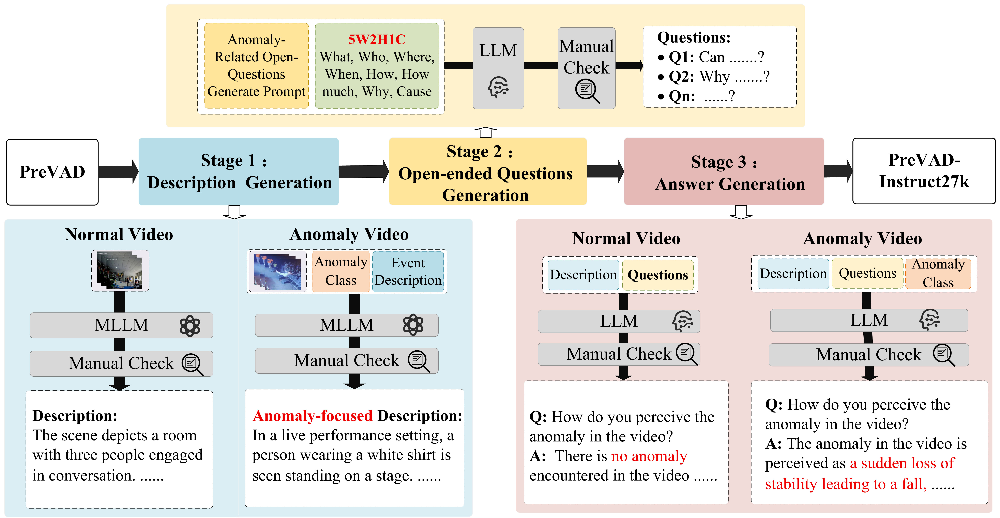

# PreVAD-Instruct27k

Official codebase for the paper **Enhancing Video Anomaly Understanding via Multi-Task Instruction Tuning**.



Overview of the dataset construction and multi-task instruction-tuning pipeline used in this project.

This repository contains:

- the `PreVAD-Instruct27k` instruction dataset annotations used in this project
- training code for Video-LLaVA-based instruction tuning
- inference scripts for abnormal description, question answering, and multi-dataset classification
- evaluation scripts for UniEval, BLEURT, and MoverScore

## Status

This repository is a research code release. The core training, inference, and metric scripts are included, and the main public-release cleanup has been started with repository-relative dataset paths, dataset preparation notes, and local artifact exclusions.

## Repository Structure

```text
.
├── datasets/
│   ├── PreVAD-Instruct27k/
│   ├── MSAD/
│   ├── UCF-Crime/
│   └── xd-violence/
├── inference/
│   ├── Abnormal description  & QA/
│   └── Classification/
├── metrics/
│   ├── BLEURT/
│   ├── MoverScore/
│   ├── UniEval/
│   └── model-answers/
├── training/
├── init_project.sh
├── env_build.sh
└── environment.yml
```

## Environment Setup

### 1. Create the Conda environment

```bash
bash env_build.sh
conda activate videollava_tuning
```

Or manually:

```bash
conda env create -f environment.yml -n videollava_tuning
conda activate videollava_tuning
```

### 2. Clone external dependencies

Some evaluation and model scripts depend on external repositories:

```bash
bash init_project.sh
```

This will clone the following projects into `external/`:

- `hawk`
- `HolmesVAU`
- `UniEval`

## Data Preparation

This repository includes dataset annotation files, but does **not** include the original raw videos or all model checkpoints.

You should prepare:

- raw videos for `PreVAD-Instruct27k`
- evaluation videos for `UCF-Crime`, `XD-Violence`, and `MSAD`
- required pretrained model weights from Hugging Face or upstream project repositories

### Important

Some scripts still assume local dataset or cache layouts. Before public release or cross-machine usage, check and adapt:

- local cache paths such as `huggingface_hub`
- task-specific checkpoint paths in inference scripts

### Public dataset sources

For the public benchmarks used in this project, download the original videos from the official pages:

- `UCF-Crime`: UCF CRCV project page
- `XD-Violence`: XD-Violence project page
- `MSAD`: MSAD dataset page

See [DATA_PREPARATION.md](/data/wxx/毕设/PreVAD-Instruct27k/DATA_PREPARATION.md) for recommended download links and local directory layout.

### Recommended local layout

```text
datasets/
├── PreVAD-Instruct27k/
│   ├── filter_train.json
│   ├── filter_test.json
│   ├── AbnormalVideos/
│   └── NormalVideos/
├── UCF-Crime/
│   └── videos/
│       └── test/
├── xd-violence/
│   └── other_datasets/
│       └── xd_videos/
└── MSAD/
    └── other_datasets/
        └── msad_videos/
```

The repository now uses repository-relative dataset paths by default. If you adapt the project to a different storage layout, prefer environment variables or a small local path config instead of hardcoded absolute paths.

### Validate your local dataset layout

After placing the videos, run:

```bash
python scripts/validate_dataset_layout.py
```

This checks whether the videos referenced by the annotation JSON files are actually present in your local repository layout.

## Training

The main training entry is:

```bash
python training/video-llava-prevad-instruct27k.py
```

For better portability, the training script now supports:

- `WANDB_API_KEY`: optional Weights & Biases login key
- `PREVAD_VIDEO_ROOT`: root directory of your local video files

Example:

```bash
export PREVAD_VIDEO_ROOT=/path/to/your/videos
export WANDB_API_KEY=your_wandb_key
python training/video-llava-prevad-instruct27k.py
```

If you do not use Weights & Biases, leave `WANDB_API_KEY` unset.

## Inference

Inference scripts are organized by task and benchmark.

### Abnormal description and QA

Scripts are under:

```text
inference/Abnormal description  & QA/
```

### Classification

Scripts are under:

```text
inference/Classification/
```

They are grouped by dataset:

- `PreVAD-Instruct27k-level-1`
- `PreVAD-Instruct27k-level-2`
- `XD-Violence`
- `MSAD`
- `UCF-Crime`

Before running them, verify:

- the local dataset paths
- the checkpoint paths
- the Hugging Face cache directory
- GPU and dependency compatibility

## Evaluation

Provided evaluation utilities:

- `metrics/UniEval/unieval-count.py`
- `metrics/BLEURT/bleurt-caculate.py`
- `metrics/MoverScore/movescore.py`

Model outputs can be organized under:

```text
metrics/model-answers/
```

## Public Release Checklist

Before pushing this repository to a public GitHub page, I recommend the following:

1. Remove or parameterize all absolute local paths.
2. Ensure no private checkpoints, cached model files, or large raw videos are tracked.
3. Add a dataset/license section clarifying what is redistributed and what must be obtained separately.
4. Add exact training and inference commands for the main results in the paper.
5. Add a `requirements` or tested environment note if you want non-Conda users to reproduce the setup.
6. Add result tables matching the paper.
7. Add citation information.

## What Should Not Be Uploaded

Do not upload:

- Hugging Face cache directories
- local conda environments
- `wandb/` logs
- large checkpoints unless you explicitly want to host them
- raw videos if redistribution rights are unclear

The included `.gitignore` already excludes common local artifacts.

## Known Cleanup Items

At the current state of this repository, there are still some portability issues to fix gradually:

- many inference scripts still hardcode local cache or checkpoint locations
- script naming and directory naming are not yet fully standardized

These do not necessarily leak API secrets, but they do expose local environment details and reduce reproducibility.

## Citation

If you use this repository, please cite:

```bibtex
@article{prevad_instruct27k,
  title={Enhancing Video Anomaly Understanding via Multi-Task Instruction Tuning},
  author={Your Name and Coauthors},
  journal={arXiv preprint},
  year={2026}
}
```

Please replace the placeholder citation with the final bibliographic information.

## Contact

For questions about the project, please open an issue on GitHub.
